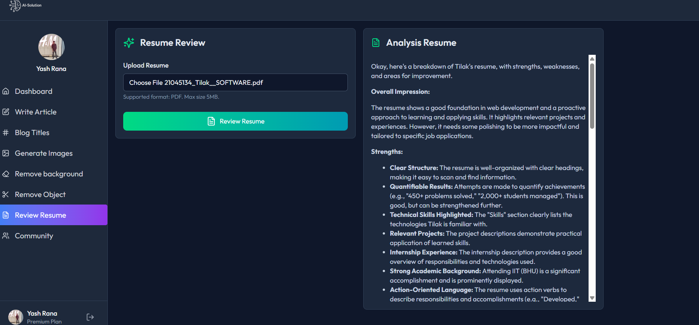
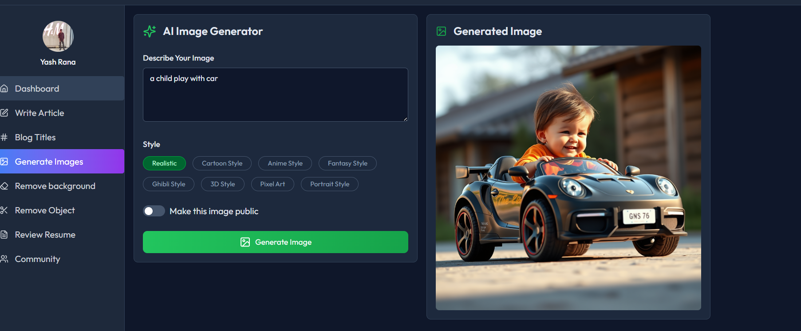
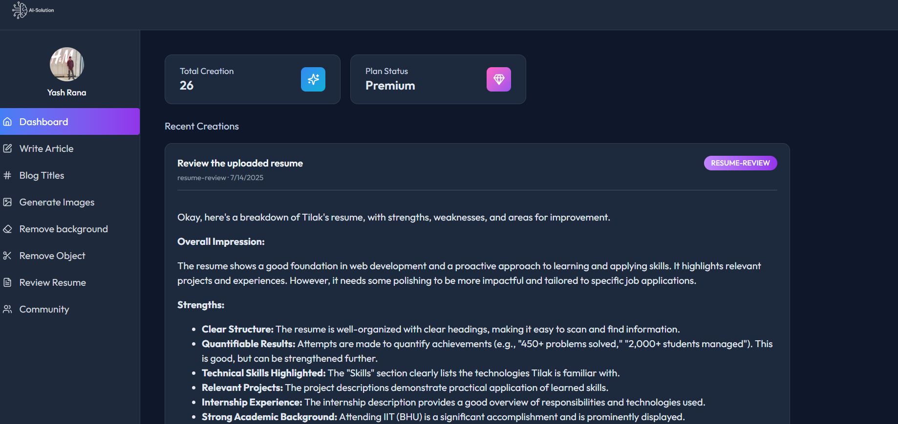

# ⚙️ SAAS Application (Software as a Service)

A full-stack SAAS platform built to help users manage subscriptions, access premium AI features, and integrate authentication and billing seamlessly. The app is built using the latest technologies and best practices for scalability and performance.

---

## 🚀 Live Demo

🔗 [View Live](https://saas-app-client-ruby.vercel.app)

---

## 📸 Screenshots

| Dashboard                        | Image Generation                    | History                  |
|----------------------------------|----------------------------------|-----------------------------------|
|  |  |  |

---

## ✨ Features

### 👥 User Features
- Signup and Login using Clerk (email, phone, social login).
- Access free & premium AI features.
- Subscription-based pricing using **Stripe**.
- View and manage your billing information.
- Profile management and session history.
- Secure and responsive UI with modern components.

---

## 🤖 AI Features

- **📝 Article Generator**: Provide title & desired length to generate detailed articles using AI.
- **📚 Blog Title Generator**: Enter keyword & category to generate engaging blog titles.
- **🖼️ Image Generator**: Enter a prompt to generate high-quality images using AI.
- **🚫 Background Remover**: Upload an image and get a transparent background version.
- **🧽 Object Remover**: Upload an image and describe the object to remove it cleanly.
- **📄 Resume Analyzer**: Upload a resume and get a complete AI-powered analysis.

---

## ⚙️ Advanced Integrations

- 🔐 **Clerk Authentication**  
  Provides secure, out-of-the-box authentication including:
  - Multi-session support
  - Social logins
  - Role-based access control
  - Test users and sessions via Clerk's developer/testing mode

- 💳 **Stripe Billing**  
  Fully integrated subscription management:
  - One-time and recurring payments
  - Webhooks to track events
  - Auto-billing and retry logic
  - Payment flow managed via Clerk's test user mode for safe dev/test billing flows


- 🔋 **Neon Database (PostgreSQL)**
  - Serverless, scalable cloud database.
  - Integrated with Prisma ORM for type-safe queries.
  - Optimized for fast connection and branching features.

---

## 🧰 Tech Stack

### 💻 Frontend
- React.js (Vite)
- Tailwind CSS
- Clerk for Authentication
- Stripe React SDK
- Context API for state management

### 🖥️ Backend
- Node.js
- Express.js Backend (Node + API Routes)
- Neon (PostgreSQL)
- Stripe Webhooks
- REST API 

---

## 📂 Folder Structure

```bash
Saas App/
├── frontend/         # React Frontend
│   ├── public/
│   └── src/
├── backend/          # Node.js + Express Backend
│   ├── routes/
│   ├── controllers/
│   └── server.js
├── screenshots/      # UI screenshots
└── README.md
```

---

## 🧰 Local Setup Instructions

### ✅ Requirements:
- Node.js installed
- Stripe Account (API keys)
- Clerk Project setup
- Neon database project

---

### 1️⃣ Clone and Install Dependencies

```bash
git clone https://github.com/YashRana52/SAAS-APP.git
cd SAAS-APP
npm install
```

---

### 2️⃣ Environment Variables

Create a `.env.local` file:

```env
NEXT_PUBLIC_CLERK_PUBLISHABLE_KEY=your_clerk_key
CLERK_SECRET_KEY=your_clerk_secret
STRIPE_SECRET_KEY=your_stripe_secret
NEXT_PUBLIC_STRIPE_PUBLISHABLE_KEY=your_stripe_public
WEBHOOK_SECRET=your_stripe_webhook_secret
DATABASE_URL=your_neon_postgres_url
```

---

### 3️⃣ Setup Database (Neon + Prisma)


---

### 4️⃣ Run the App

```bash
npm run dev
```

> App will be available at `http://localhost:3000`

---

## 👨‍💻 Author

**Yash Rana**  
🎓 IET Lucknow  
📧 yashrana2200520100072@gmail.com  
🔗 [LinkedIn](https://www.linkedin.com/in/yashrana52)  
💻 [GitHub](https://github.com/YashRana52)

---

